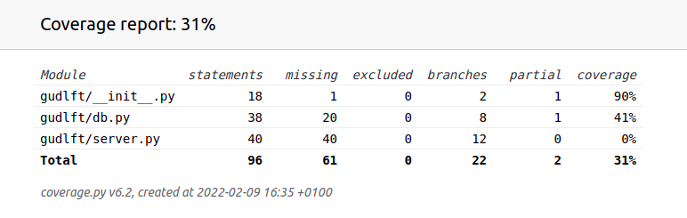
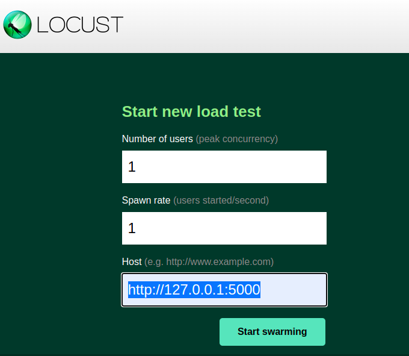
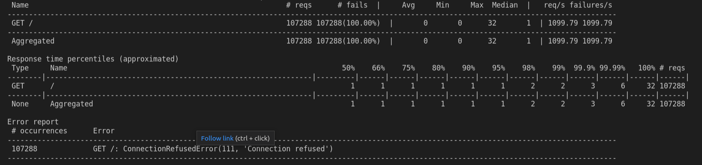

# openclassroom - projet11 - application with Flask

| Güdlft |
|:----------:|

_Owner: [Amélie](https://github.com/ameliebnpp)_

## Developpement guide

### General informations

This project is developped with :
- Python(programming language),
- Flask(micro web framework), 
- Pytest(test framework), 
- Locust(performance test)

### Installation

1. Clone the project:

```bash
git clone --recursive git@github.com:amelieBNPP/gudlft.git
```
*Clone only one time the project.*

2. Active the virtual environement:
```bash
python3 -m venv env
source env/bin/activate
```
*The virtual environement is created only one time, however, it is activate each time we start to develop.*

### Dependencies

Install dependencies :

```bash
pip install -r requirements.txt
```
*Install dependancies each time we develop on this project.*

### Run server

Server can be run using the following commands:
```bash
export FLASK_APP=gudlft
export FLASK_ENV=development
flask init-db # Initialize the Database File.
flask load-db # Load existing values
python3 -m flask run
```

The API can be tested in local at the following adresse : http://127.0.0.1:5000/

### Tests
#### Debug

Debuging can be manage easily with Debug mode:
```bash
export FLASK_DEBUG=1
```
#### Launch tests

To ensure new features do not add any regression in the code, run the tests with the following commands : 
```bash
pytest
```

#### Coverage report

To ensure the tests coverage of the api we can use : 
```bash
coverage run -m pytest
coverage report
# An HTML report allow to see code lines covered by tests in htmlcov/index.html file
coverage html
```

Coverage report : \

### Locust

Locust is an easy to create stress tests in python.
[Locust documentation](https://docs.locust.io/en/stable/quickstart.html#quickstart)_
```bash
locust
```
Point the test to your own web server : http://127.0.0.1:5000 \


Analyze report : \
